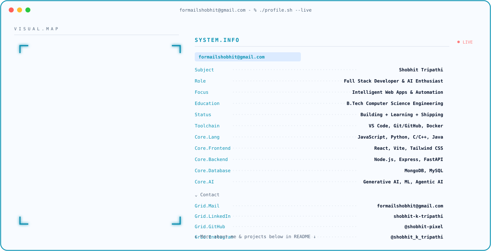

<picture>
  <source media="(prefers-color-scheme: dark)" srcset="./dark.svg">
  <source media="(prefers-color-scheme: light)" srcset="./light.svg">
  
</picture>

 

 

## 💻 Tech Stack

## ⚡ Featured Projects

 

## 🐍 Contribution Activity

## 🌐 Connect With Me

  

**⚡ Building intelligent software, one commit at a time.**

